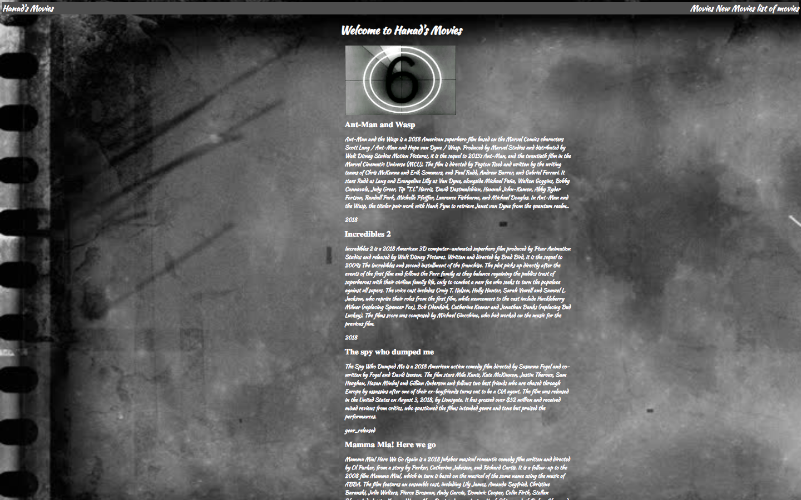
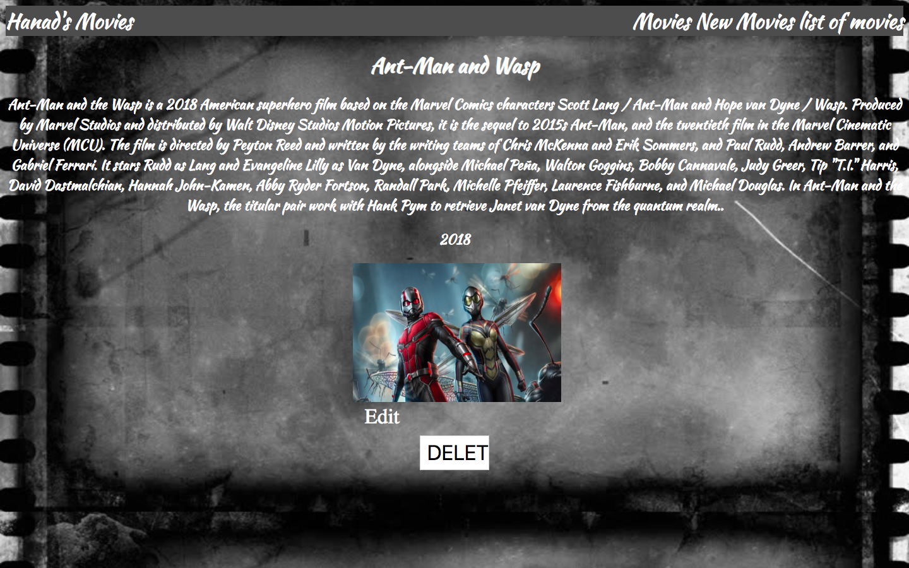
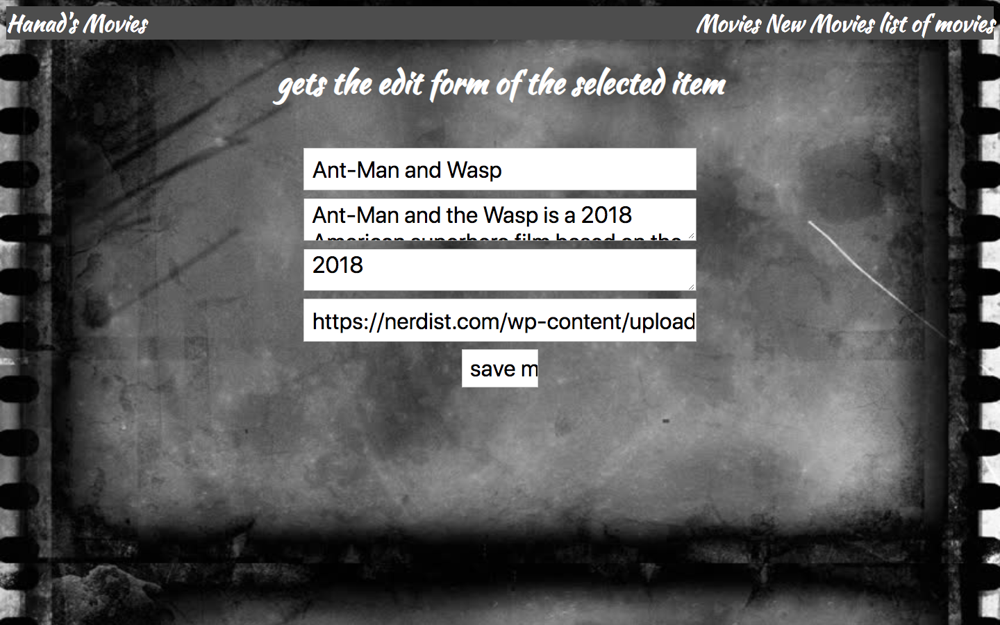
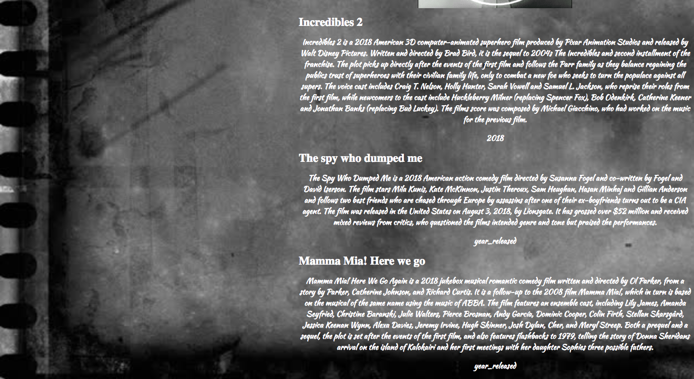
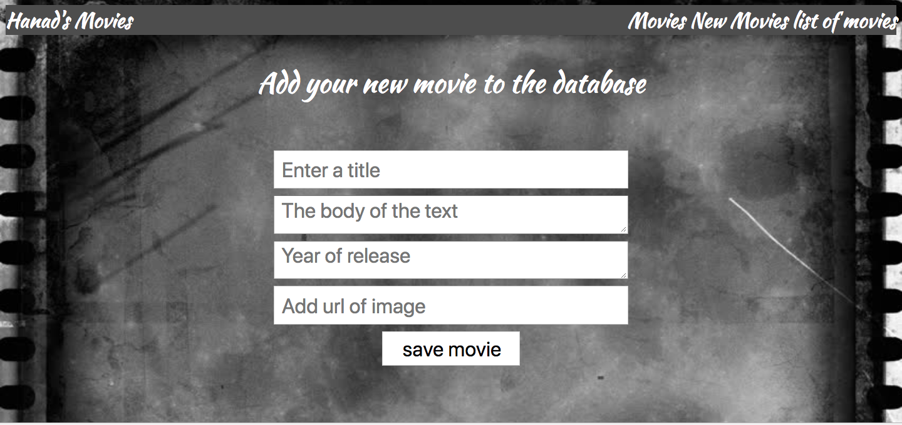

# Full stack web application

## Movies web app

### Purpose
The purpose was to build a full stack application. The web application should be built using backend sintara,ruby, Rack and postgres. The choice of the resource was up to us to decide what resource we wanted to build.

### Requirements of the web app
* Create a full stack web application using Ruby, Sinatra, Rack and Postgres
* Use a different resource that we used when developing a full stack application.
* Must be able to perform all CRUD actions
* Use postgres to store and display data from my database.
* Must use the 7 RESTful routes.
* Include static assets to make the web app look more professional and stylish.
* Create dynamic web pages using ERB.
* Can include jquery and Javascript as a bonus.

### Implementation
* Ruby
* Sinatra
* CSS
* Rack
* Postgres
* Atom

